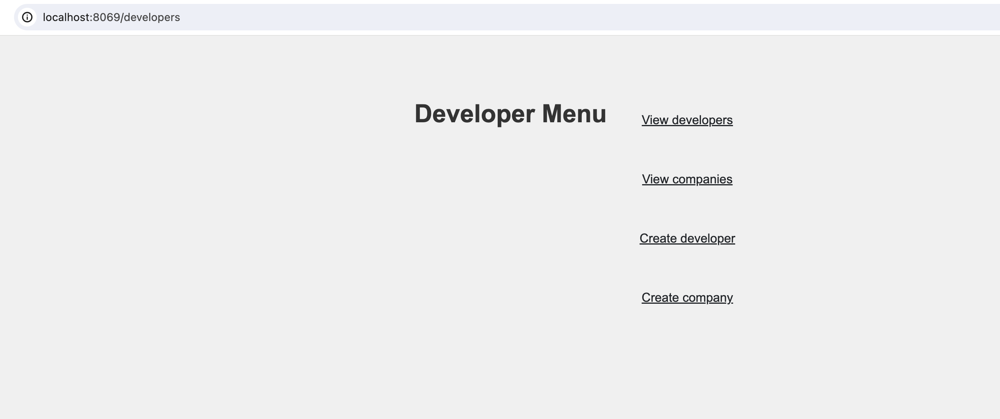
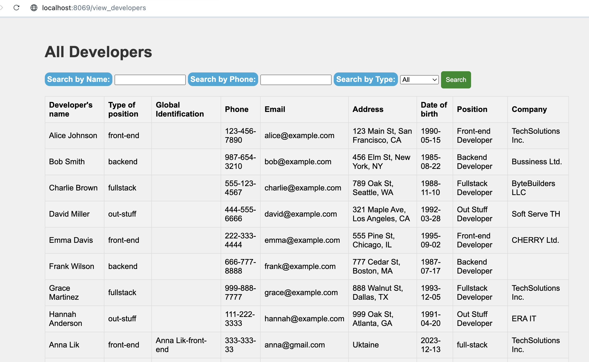
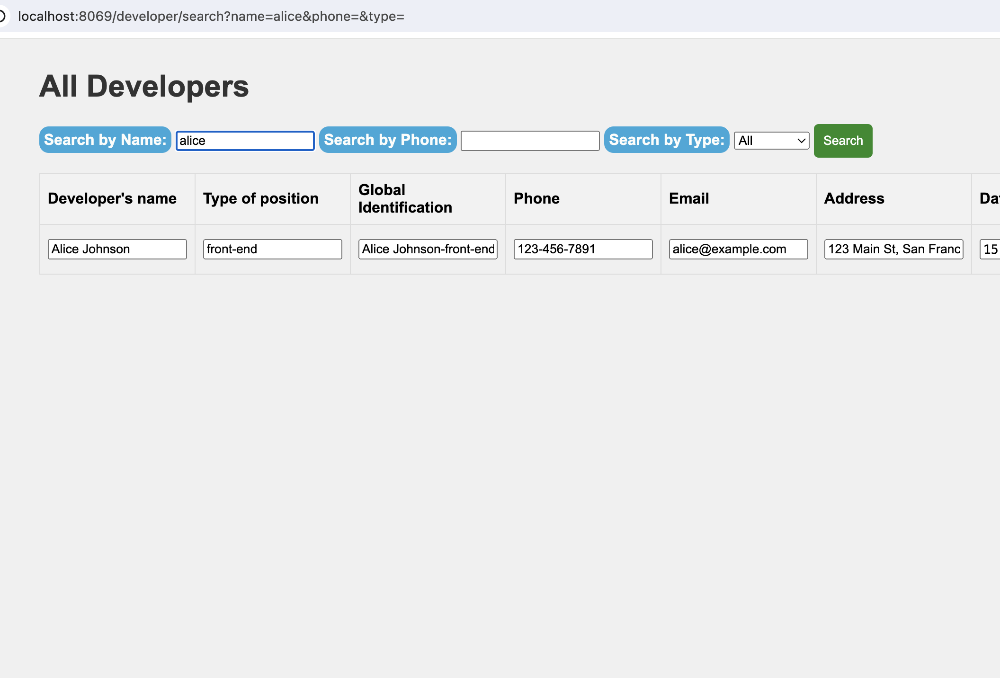
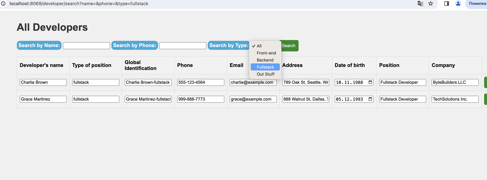
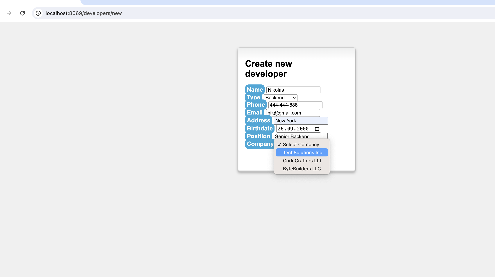
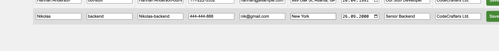
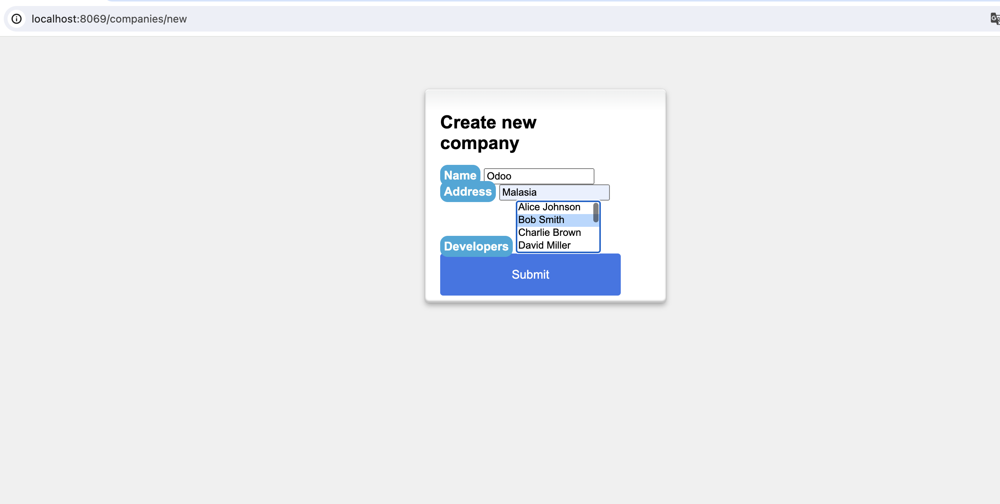
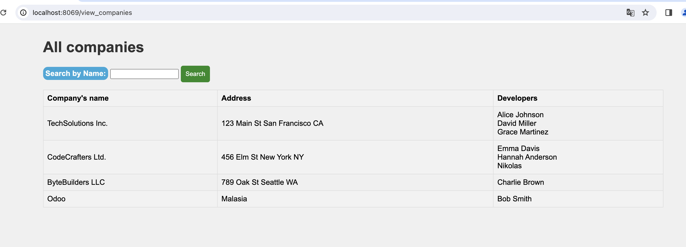

# Developer Manager

# Installation : 

## Rename .env.copy on .env file update variables with new creds :
IN .env 
```bash
    POSTGRES_PASSWORD=your_db_password
    POSTGRES_USER=your_db_user
    POSTGRES_DB=your_database_name
```

## Run docker 
```bash
    docker-compose up -d 
```

## Init database with docker
```bash
        docker-compose exec web usr/bin/odoo -i base -d your_database_name --db_host db -r your_db_user -w your_db_password --stop-after-init
 ```

## Change password for user in db to login in Odoo
```bash
    docker exec -it odoo_developers_manager-db-1 /bin/bash
    psql -U <your_db_user> -d <your_database_name>
    UPDATE res_users SET password='password' WHERE login='admin';
```

## Login using creads on localhost 
http://localhost:8069/web/login 
```bash
    Email : admin
    Password : password
```


## Activate module 
```bash
docker-compose exec web /usr/bin/odoo -d <your_db_name>--db_host db -r <your_db_user> -w <your_db_password> -u dev 
```

## INSERT TEST DATA TO DB:

```bash
docker exec -it odoo_developers_manager-db-1 /bin/bash
```
```bash
psql -U <your_db_user> -d <your_database_name>
```
```bash
INSERT INTO developers_management_company (name, address) VALUES
    ('TechSolutions Inc.', '123 Main St San Francisco CA'),
    ('CodeCrafters Ltd.', '456 Elm St New York NY'),
    ('ByteBuilders LLC', '789 Oak St Seattle WA');
```

```bash
INSERT INTO developers_management_developer (name, type, phone, email, address, birthdate, position, company_id) VALUES
    ('Alice Johnson', 'front-end', '123-456-7890', 'alice@example.com', '123 Main St, San Francisco, CA', '1990-05-15', 'Front-end Developer', (SELECT id FROM developers_management_company WHERE name = 'TechSolutions Inc.')),
    ('Bob Smith', 'backend', '987-654-3210', 'bob@example.com', '456 Elm St, New York, NY', '1985-08-22', 'Backend Developer', (SELECT id FROM developers_management_company WHERE name = 'CodeCrafters Ltd.')),
    ('Charlie Brown', 'fullstack', '555-123-4567', 'charlie@example.com', '789 Oak St, Seattle, WA', '1988-11-10', 'Fullstack Developer', (SELECT id FROM developers_management_company WHERE name = 'ByteBuilders LLC')),
    ('David Miller', 'out-stuff', '444-555-6666', 'david@example.com', '321 Maple Ave, Los Angeles, CA', '1992-03-28', 'Out Stuff Developer', (SELECT id FROM developers_management_company WHERE name = 'TechSolutions Inc.')),
    ('Emma Davis', 'front-end', '222-333-4444', 'emma@example.com', '555 Pine St, Chicago, IL', '1995-09-02', 'Front-end Developer', (SELECT id FROM developers_management_company WHERE name = 'CodeCrafters Ltd.')),
    ('Frank Wilson', 'backend', '666-777-8888', 'frank@example.com', '777 Cedar St, Boston, MA', '1987-07-17', 'Backend Developer', (SELECT id FROM developers_management_company WHERE name = 'ByteBuilders LLC.')),
    ('Grace Martinez', 'fullstack', '999-888-7777', 'grace@example.com', '888 Walnut St, Dallas, TX', '1993-12-05', 'Fullstack Developer', (SELECT id FROM developers_management_company WHERE name = 'TechSolutions Inc.')),
    ('Hannah Anderson', 'out-stuff', '111-222-3333', 'hannah@example.com', '999 Oak St, Atlanta, GA', '1991-04-20', 'Out Stuff Developer', (SELECT id FROM developers_management_company WHERE name = 'CodeCrafters Ltd.'));
```

# Functionality :

### Main page:
http://localhost:8069/developers



### Views developers:


### Search by name/phone or group by type:




### Create developer:

result:


### Create company:

result:



# Run tests

```bash
docker cp ./test.py odoo_developers_manager-web-1:/mnt/extra-addons/test.py   
docker-compose exec web python3 /mnt/extra-addons/test.py
```


